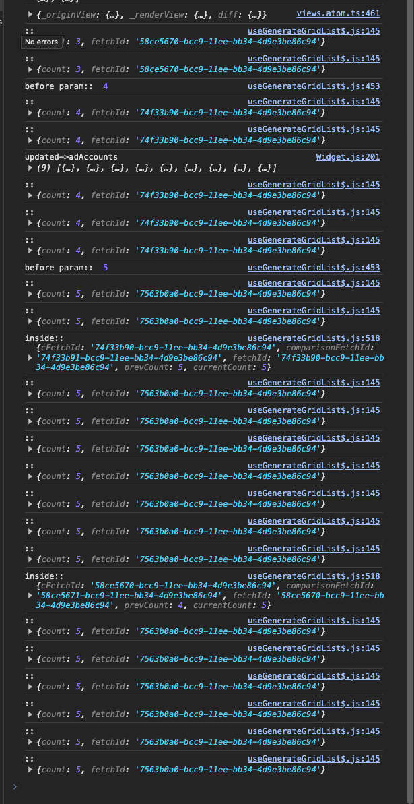

### Situation

-   requestData
    -   requestData 생성 시
    -   IIFE: params 호출 with fetchId → prevFetchId
        -   prevFetchId ≠ fetchId: 업데이트 막기
            -   그러나 fetchId가 state
                -   목적은 fetchId state 갱신 시 IIFE params가 물고 있는 prefFetchId와 갱신된 fetchId가 구분 가능하다는 가정하에 실행
                    -   결과는 React state 갱신 시 과거 IIFE에서 바라보는 fetchId는 갱신된 fetchId가 아니다

### Behavior

-   fetchId를 value 상태가 아닌 reference 상태로 변경
-   IIFE params 호출 시 reference 가 가진 값을 넘겨주고 prevFetchId로 사용
-   비교시 refence 내부 id값과 호출 시 사용하 prev id 값 비교

### Impact

-   IIFE params 호출 시 넘겨준 id 값은 호출 된 시점 값 고정
-   requestData 내부 callback 호출 시 사용하는 시점 id reference 값은 최신 상태 유지

prevFetchId와 currentFetchId를 구별 가능하게 되면서 과거 유효하지 않은 데이터가 유효한 데이터로 덮어쓰는 현상 해결
